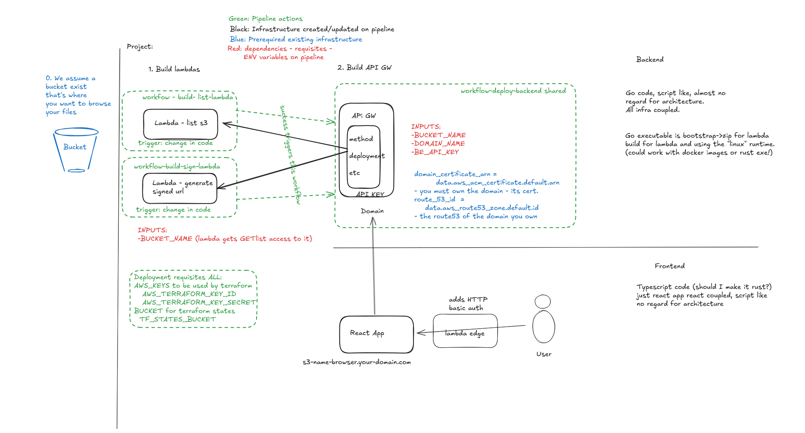

Project that deploys an app to browse the content of an s3.

FE is secured with basic authentication.

BE is just a couple of lambdas.

The infra for BE is just 2 lambdas.

Pipeline is to deploy first the API GW, then the two lambdas depending on that
reusing the same lambda module. Executed by github.

Put the graph here with better explanation.

The devops side is that whenever the code in the lambdas change they are being
deployed, but it assumes an static infra which is the existence of the API GW.

Infra doesn't have "environments" it's all in production.

FE pipeline is independent and I havet started yet.

