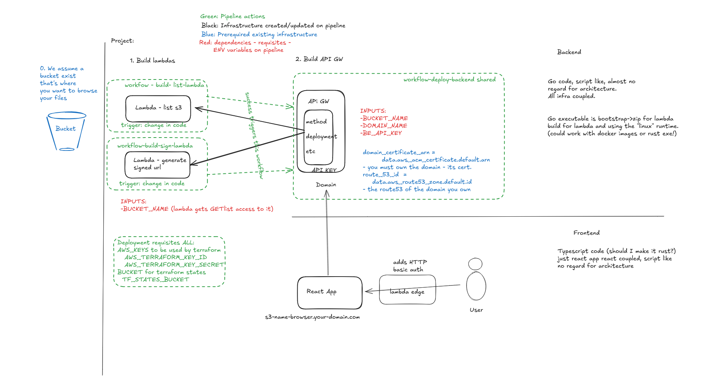

Project that deploys an app to browse the content of an s3.

FE is secured with basic authentication.

BE is just a couple of lambdas.

The infra for BE is just 2 lambdas.

Pipeline is to deploy first the API GW, then the two lambdas depending on that
reusing the same lambda module. Executed by github.

The devops side is that whenever the code in the lambdas change they are being
deployed, but it assumes an static infra which is the existence of the API GW.

Infra doesn't have "environments" it's all in production.


FE pipeline is independent and I havet started yet.




Doing this to set logs in CW:

```
aws iam create-role --role-name APIGatewayCloudWatchLogsRole \
  --assume-role-policy-document '{
    "Version": "2012-10-17",
    "Statement": [{
      "Effect": "Allow",
      "Principal": {"Service": "apigateway.amazonaws.com"},
      "Action": "sts:AssumeRole"
    }]
  }'
```

+

```
aws iam attach-role-policy \
  --role-name APIGatewayCloudWatchLogsRole \
  --policy-arn arn:aws:iam::aws:policy/service-role/AmazonAPIGatewayPushToCloudWatchLogs
```

```
$aws apigateway update-account --patch-operations op=replace,path=/cloudwatchRoleArn,value="arn:aws:iam::526774264214:role/APIGatewayCloudWatchLogsRole"
```


To test lambda:

aws apigateway get-resources --rest-api-id x3xecogfjg (and get teh resource ID)

aws apigateway test-invoke-method   --rest-api-id x3xecogfjg   --resource-id  303gby   --http-method GET   --path-with-query-string "/list-s3"   --body '{"bucket":"YOUR_BUCKET","key":"YOUR_PREFIX"}'